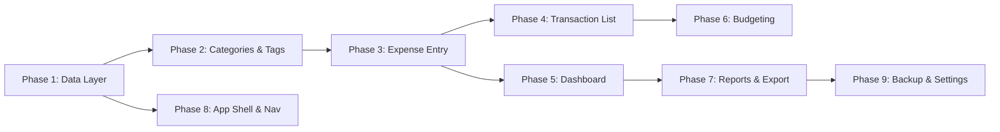

# Pocket Khali — MVP Implementation Plan

## Current State

The project is a **fresh scaffold** with the following already in place:
- **React 19 + Vite 7 + TypeScript** — core framework
- **TailwindCSS v4 + shadcn/ui** (radix-nova style) — UI components (button, card, dialog, sheet, input, select, tabs, etc.)
- **TanStack Router** — file-based routing (only `/` route exists)
- **Dexie.js v4** — IndexedDB wrapper (installed but only has an empty DB instance)
- **vite-plugin-pwa** — PWA manifest + service worker (basic config)
- **Recharts** — already installed via shadcn chart component
- **Inter font, Lucide icons, ThemeProvider** (dark/light/system)
- Two placeholder pages: `HomePage`, `AnalyticsPage`

**Everything functional needs to be built from scratch.**

---

## Decisions Confirmed

| Decision | Choice |
|----------|--------|
| App name | **Pocket Khali** |
| CSS framework | TailwindCSS v4 + shadcn/ui |
| Chart library | Recharts (already installed via shadcn) |
| Photo handling | Basic file input → heavy compression (compressorjs/pica) → store in IndexedDB |
| Verification | Developer runs build/typecheck; user does manual testing |

---

## Phased Build Order



---

## Phase 1: Data Layer (Dexie Schema + Types)

> **Goal**: Define the complete IndexedDB schema and TypeScript interfaces so every future phase just imports and uses them.

### [MODIFY] [db.ts](file:///j:/pocketKhali/src/lib/db.ts)

Define a proper Dexie subclass with versioned schema:

| Table | Key Fields | Indexes |
|-------|-----------|---------|
| `expenses` | `id` (auto), `amount`, `currency`, `categoryId`, `description`, `notes`, `tags[]`, `paymentMethod`, `date`, `photo?` (compressed Blob), `createdAt`, `updatedAt` | `date`, `categoryId`, `[categoryId+date]` |
| `categories` | `id` (auto), `name`, `icon`, `color`, `isCustom`, `keywords[]`, `order` | `name` |
| `tags` | `id` (auto), `name`, `color?` | `name` |
| `budgets` | `id` (auto), `categoryId`, `amount`, `period` (monthly/weekly), `startDate` | `categoryId`, `period` |
| `settings` | `key` (primary), `value` | — |

> [!NOTE]
> The `categories.keywords[]` field stores words for the **smart category guess** feature. E.g., Transport category has `["bus", "uber", "taxi", "rickshaw", "cng", "fuel", "gas"]`. When the user types a description, we match against these keywords to auto-select the category.

### [NEW] [types.ts](file:///j:/pocketKhali/src/lib/types.ts)

TypeScript interfaces:

```typescript
interface Expense {
  id?: number
  amount: number
  currency: string          // default "BDT"
  categoryId: number
  description: string
  notes?: string            // optional longer notes
  tags: string[]
  paymentMethod: PaymentMethod
  date: Date                // defaults to now
  photo?: Blob              // compressed image blob
  createdAt: Date
  updatedAt: Date
}

type PaymentMethod = "cash" | "bank_card" | "bkash" | "rocket" | "nagad"

interface Category {
  id?: number
  name: string
  icon: string              // Lucide icon name
  color: string             // hex color
  isCustom: boolean
  keywords: string[]        // for smart auto-guess
  order: number
}

interface Tag { id?: number; name: string; color?: string }

interface Budget {
  id?: number
  categoryId: number
  amount: number
  period: "monthly" | "weekly"
  startDate: Date
}

// Budget status levels
type BudgetStatus = "normal" | "warning" | "critical" | "overspent"
```

### [NEW] [seed.ts](file:///j:/pocketKhali/src/lib/seed.ts)

Seed function to populate default categories on first launch:

| Category | Icon | Color | Keywords |
|----------|------|-------|----------|
| Food & Dining | `utensils` | `#ef4444` | food, lunch, dinner, breakfast, restaurant, eat, meal, snack, coffee, tea |
| Transport | `car` | `#3b82f6` | bus, uber, taxi, rickshaw, cng, fuel, gas, fare, train, ride |
| Rent | `home` | `#8b5cf6` | rent, house, apartment, flat |
| Utilities | `zap` | `#f59e0b` | electricity, water, gas, internet, wifi, bill, phone |
| Entertainment | `gamepad-2` | `#ec4899` | movie, netflix, game, fun, party, concert, show |
| Shopping | `shopping-cart` | `#10b981` | shop, buy, purchase, amazon, clothes, shoes, mall |
| Health | `heart-pulse` | `#06b6d4` | medicine, doctor, hospital, pharmacy, gym, health |
| Education | `book-open` | `#6366f1` | book, course, tuition, school, college, class, study |
| Personal | `user` | `#f97316` | grooming, haircut, salon, personal |
| Other | `package` | `#6b7280` | *(catch-all, no keywords)* |

Default settings seeded:
- `defaultCurrency`: `"BDT"`
- `defaultPaymentMethod`: `"cash"`

---

## Phase 2: Categories & Tags Management

> **Goal**: CRUD for categories and tags with color coding. Prerequisite for expense entry.

### [NEW] [pages/categories/index.tsx](file:///j:/pocketKhali/src/pages/categories/index.tsx)

- Grid/list of categories with color dots, icon previews
- Reorder via drag or up/down buttons
- Add/Edit/Delete with confirmation

### [NEW] [components/category-form.tsx](file:///j:/pocketKhali/src/components/category-form.tsx)

Dialog for add/edit category:
- Name input
- Icon picker (grid of common Lucide icons)
- Color picker (palette of curated colors)
- Keywords input (comma-separated, for smart guess)

### [NEW] [hooks/use-categories.ts](file:///j:/pocketKhali/src/hooks/use-categories.ts)

Custom hook wrapping `useLiveQuery` for reactive category operations.

### [NEW] [hooks/use-tags.ts](file:///j:/pocketKhali/src/hooks/use-tags.ts)

Custom hook for reactive tag list CRUD.

---

## Phase 3: Quick Expense Entry

> **Goal**: The core feature — "Log expenses in 3 seconds." Floating action button → lean form → instant save.

> [!IMPORTANT]
> **UX principle**: Don't bloat the form. Show only essential fields upfront, tuck advanced options behind expandable sections.

### Form Layout Strategy

**Always visible (above the fold):**
- 💰 **Amount** — large prominent numeric input (BDT ৳ prefix)
- 📝 **Description** — single-line text input → **triggers smart category guess**
- 🏷️ **Category** — horizontal scrollable chips (auto-selected by keyword match)
- ✅ **Save** button

**Collapsed / "More options" section:**
- 📅 Date/Time (defaults to **now** — most users won't change it)
- 💳 Payment method (defaults to user's **default from settings**)
- 🏷️ Tags (multi-select chips)
- 📝 Notes (longer text)
- 📷 Photo (file input)

### Smart Category Guess

```
User types "bus ticket" in description
→ scan words against categories[].keywords
→ "bus" matches Transport
→ auto-select Transport category chip (user can override)
→ if multiple matches, use the LAST matching word's category
```

Implementation: simple `string.split` + `includes` check against the keywords array. Runs on `onChange` with debounce (~300ms).

### [NEW] [components/expense-form.tsx](file:///j:/pocketKhali/src/components/expense-form.tsx)

Form rendered in a **Sheet** (bottom slide-up):
- Smart defaults: current date, default payment method from settings, default currency
- Category auto-guess from description keywords
- Compression pipeline for photos before IndexedDB storage

### [NEW] [components/fab.tsx](file:///j:/pocketKhali/src/components/fab.tsx)

Floating Action Button (`+`) — fixed bottom-right above bottom nav, animated.

### [NEW] [hooks/use-expenses.ts](file:///j:/pocketKhali/src/hooks/use-expenses.ts)

CRUD operations: `addExpense`, `updateExpense`, `deleteExpense`, plus reactive queries.

### [NEW] [lib/image-compress.ts](file:///j:/pocketKhali/src/lib/image-compress.ts)

Image compression utility using **browser-image-compression** or **compressorjs**:
- Target: **50KB max** per photo (aggressive compression)
- Output format: WebP (if supported) or JPEG
- Max dimensions: 800×800px
- Quality: 0.4–0.6

### New Dependency

```bash
npm install compressorjs
```

---

## Phase 4: Transaction List & Search

> **Goal**: Filterable, searchable list of all expenses with edit/delete.

### [NEW] [pages/transactions/index.tsx](file:///j:/pocketKhali/src/pages/transactions/index.tsx)

- **Search bar** at top (keyword search across description, notes, tags, category name)
- **Filter chips**: date range, category, payment method
- **Grouped list**: expenses grouped by date (Today, Yesterday, This Week, Earlier)
- Each row: category icon + color dot, description, amount (bold ৳), time
- Tap → open expense-form in **edit mode** (reuse Phase 3 form)
- Swipe-left or delete button → confirm → delete

### Route

- `/transactions`

---

## Phase 5: Dashboard Home

> **Goal**: At-a-glance financial overview — the default landing page.

### [MODIFY] [pages/home/index.tsx](file:///j:/pocketKhali/src/pages/home/index.tsx)

Complete redesign:

1. **Header**: Month selector (← April 2026 →)
2. **Summary Card**: Total spent this month (large ৳ number) + % change vs last month (green ↓ / red ↑ badge)
3. **Category Pie Chart**: Donut chart of spending by category (Recharts `PieChart` via shadcn chart component)
4. **Weekly Trend**: Area/bar chart showing daily spend this month (Recharts `AreaChart`)
5. **Recent Transactions**: Last 5 expenses (compact cards, tap for full list)
6. **Budget Alerts**: Quick glance at any categories in warning/critical/overspent status (from Phase 6)

### [NEW] [hooks/use-dashboard-stats.ts](file:///j:/pocketKhali/src/hooks/use-dashboard-stats.ts)

Reactive computed stats: `totalThisMonth`, `totalLastMonth`, `percentChange`, `byCategory[]`, `dailyTrend[]`, `recentExpenses[]`.

---

## Phase 6: Budgeting with Tiered Warning System

> **Goal**: Per-category budgets with 4-tier visual warning system.

### Warning Tiers

| Level | % Used | Progress Bar | In-App Message (on expense save) | Color |
|-------|--------|-------------|----------------------------------|-------|
| **Normal** | < 80% | Green | None | `#22c55e` |
| **Warning** | 80–89% | Yellow | "You're at {X}% of your {Category} budget" | `#eab308` |
| **Critical** | 90–99% | Red | "Only {X}% left in {Category}!" | `#ef4444` |
| **Overspent** | ≥ 100% | Red + "Over" badge | "You've gone over budget in {Category}" | `#dc2626` |

### [NEW] [pages/budgets/index.tsx](file:///j:/pocketKhali/src/pages/budgets/index.tsx)

- List of active budgets with animated progress bars (color transitions through tiers)
- Each budget row: category icon, name, ৳ spent / ৳ limit, progress bar, status badge
- "Add Budget" → form dialog

### [NEW] [components/budget-form.tsx](file:///j:/pocketKhali/src/components/budget-form.tsx)

Set limit per category + period (monthly/weekly).

### [NEW] [hooks/use-budgets.ts](file:///j:/pocketKhali/src/hooks/use-budgets.ts)

- CRUD for budgets
- `getBudgetStatus(categoryId): { spent, limit, percent, status: BudgetStatus }` — computes for current period
- `getAllBudgetStatuses()` — for dashboard overview

### Integration with Expense Entry (Phase 3)

When saving an expense, check if the category has a budget → compute new total → show **toast alert** with appropriate tier message if ≥ 80%.

---

## Phase 7: Reports & Insights + Export

> **Goal**: Deeper analytics with date-scoped breakdowns and data export.

### [MODIFY] [pages/analytics/index.tsx](file:///j:/pocketKhali/src/pages/analytics/index.tsx)

Full reports page with **tabs** (shadcn Tabs component):

1. **Category Breakdown** tab
   - Donut chart + table (category, ৳ amount, % of total, # transactions)
   - Date range picker

2. **Time Trends** tab  
   - Weekly/monthly/yearly bar charts
   - This month vs last month comparison

3. **Export** tab
   - Export as CSV / Export as JSON buttons
   - Date range selector for export scope
   - Preview of row count

### [NEW] [lib/export.ts](file:///j:/pocketKhali/src/lib/export.ts)

`exportToCSV(expenses)`, `exportToJSON(expenses)` — generates Blob → `URL.createObjectURL` → triggers download.

---

## Phase 8: App Shell & Navigation

> **Goal**: Mobile-first app shell with bottom navigation bar and proper routing.

### [NEW] [components/app-shell.tsx](file:///j:/pocketKhali/src/components/app-shell.tsx)

Wraps all pages:
- **Bottom navigation bar** (5 slots):
  - Home 🏠 | Transactions 📋 | **FAB (+)** center | Budgets 💰 | More ⚙️
- Active tab indicator with subtle animation
- Safe area padding (mobile notches, bottom nav offset)
- Page content scrolls independently above fixed bottom bar

### [MODIFY] [routes/__root.tsx](file:///j:/pocketKhali/src/routes/__root.tsx)

Wrap `<Outlet />` with AppShell.

### [NEW] Route files

- `routes/transactions.tsx`
- `routes/budgets.tsx`
- `routes/analytics.tsx`
- `routes/categories.tsx`
- `routes/settings.tsx`

### PWA Polish

- Update manifest: proper description, dark theme color, display `standalone`
- Verify service worker caches app shell properly

---

## Phase 9: Settings & Data Backup

> **Goal**: User preferences, data export/import, app configuration.

### [NEW] [pages/settings/index.tsx](file:///j:/pocketKhali/src/pages/settings/index.tsx)

Settings page sections:

| Section | Options |
|---------|---------|
| **Appearance** | Theme toggle (Dark / Light / System) |
| **Defaults** | Default currency (BDT), Default payment method |
| **Categories** | Link to manage categories |
| **Data** | Export full backup (JSON), Import backup, Clear all data (with confirmation) |
| **About** | App version, credits |

### [NEW] [hooks/use-settings.ts](file:///j:/pocketKhali/src/hooks/use-settings.ts)

Read/write settings from the `settings` table in Dexie: `getSetting(key)`, `setSetting(key, value)`, `useSettingLive(key)`.

### [NEW] [lib/backup.ts](file:///j:/pocketKhali/src/lib/backup.ts)

- `exportDatabase()` — dumps all tables to a single JSON with metadata (version, date, counts)
- `importDatabase(file)` — parses, validates schema version, shows confirmation with counts → replaces data

---

## Recurring Expenses

> [!NOTE]
> Per the PRD roadmap, recurring expenses are slated for **v1.2** (post-MVP). The data schema in Phase 1 does **not** include a recurring expenses table — we'll add it later with fields like `recurringId`, `frequency`, `nextDueDate`, `templateExpenseId`. For MVP, users manually add repeated expenses.

---

## Future Enhancements (Post-MVP, not in this plan)

- **AI Insights** — "You spent 30% more on food this month" (will integrate later)
- **Recurring Expenses** — v1.2 with auto-add + reminders
- **Multi-Currency** — per-transaction currency toggle with conversion rates
- **Custom Payment Methods** — CRUD for payment method options
- **Push Notifications** — budget alerts, weekly summary via service worker
- **Cloud Sync** — encrypted sync via Supabase/Firebase
- **PIN/Biometric Lock** — privacy protection

---

## File Structure (Final)

```
src/
├── components/
│   ├── ui/                    # shadcn components (existing)
│   ├── app-shell.tsx          # Phase 8
│   ├── expense-form.tsx       # Phase 3
│   ├── fab.tsx                # Phase 3
│   ├── category-form.tsx      # Phase 2
│   └── budget-form.tsx        # Phase 6
├── hooks/
│   ├── use-categories.ts      # Phase 2
│   ├── use-tags.ts            # Phase 2
│   ├── use-expenses.ts        # Phase 3
│   ├── use-budgets.ts         # Phase 6
│   ├── use-dashboard-stats.ts # Phase 5
│   └── use-settings.ts        # Phase 9
├── lib/
│   ├── db.ts                  # Phase 1 (modify)
│   ├── types.ts               # Phase 1
│   ├── seed.ts                # Phase 1
│   ├── utils.ts               # existing
│   ├── image-compress.ts      # Phase 3
│   ├── export.ts              # Phase 7
│   └── backup.ts              # Phase 9
├── pages/
│   ├── home/index.tsx         # Phase 5 (modify)
│   ├── transactions/index.tsx # Phase 4
│   ├── categories/index.tsx   # Phase 2
│   ├── budgets/index.tsx      # Phase 6
│   ├── analytics/index.tsx    # Phase 7 (modify)
│   └── settings/index.tsx     # Phase 9
├── routes/
│   ├── __root.tsx             # Phase 8 (modify)
│   ├── index.tsx              # existing
│   ├── transactions.tsx       # Phase 8
│   ├── budgets.tsx            # Phase 8
│   ├── analytics.tsx          # Phase 8
│   ├── categories.tsx         # Phase 8
│   └── settings.tsx           # Phase 8
├── App.tsx
├── main.tsx
└── index.css
```

---

## Verification Plan

### After Each Phase (Developer)
- `npm run dev` — no build errors
- `npm run typecheck` — TypeScript passes
- `npm run lint` — no lint errors
- `npm run build` — production build succeeds

### Manual Verification (User)
- Visual inspection of each feature
- Offline behavior testing
- Mobile viewport testing
- IndexedDB data persistence
- PWA install flow
